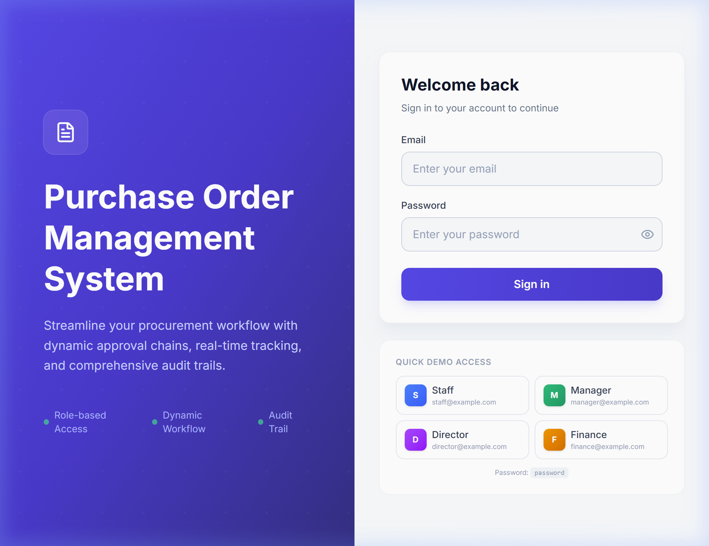
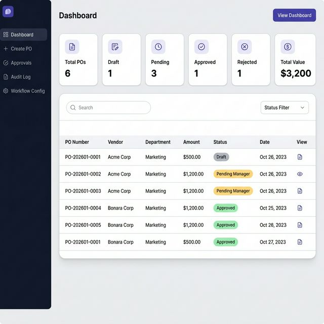
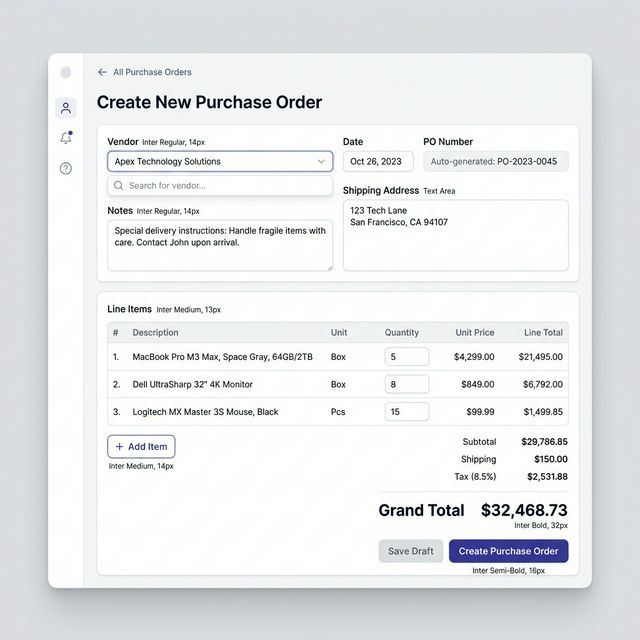
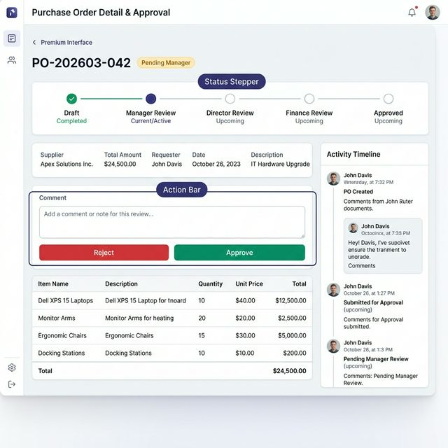

# 🚀 Purchase Order Management System (Laravel 12 + React)

A production-grade, enterprise-scale Purchase Order (PO) Management System built with a focus on clean architecture, security, and dynamic workflow automation.

---

## 🏗️ Architecture Overview

The system is architected using modern PHP 8.2+ and Laravel 12 features, following **Domain-Driven Design (DDD)** lite principles to ensure scalability and maintainability.

### Backend Strategy
*   **Service Layer Pattern:** All business logic is encapsulated in `PurchaseOrderService.php`, keeping controllers thin and focused on delegation.
*   **Dynamic Workflow Engine:** Workflow transitions are not hardcoded. The `WorkflowService.php` uses JSON-defined logic in the `approval_rules` table to determine transition states based on conditions like amount thresholds and department roles.
*   **Row-Level Security:** A global `DepartmentScope` automatically filters database queries based on the authenticated user's department, with override logic for 'Director' and 'Finance' roles.
*   **Event-Driven:** Uses Laravel Events and Listeners (processed via Redis queues) to handle asynchronous operations like email notifications.
*   **Audit Trail:** Comprehensive logging of all status changes via `po_status_logs`, recording actor, action, and metadata (IP, Role, etc.).

### Frontend Strategy
*   **Vite + React + Tailwind:** A high-performance SPA using Tailwind CSS for a premium enterprise interface.
*   **Axios Interceptors:** Centralized API communication with automatic JWT (Sanctum) token management and 401/403 handling.
*   **Interactive UI:** Modern features like real-time amount calculation, status stepper tracking, and role-based action buttons.

---

## 📦 Key Features

### 1. Purchase Order Lifecycle
*   **Status Flow:** `draft` → `pending_manager` → `pending_director` → `pending_finance` → `approved/rejected`.
*   **Versioning:** Supports PO revisions via `parent_po_id` to maintain historical records of changes after rejection.
*   **Items Management:** Dynamic line-item entry with automatic total calculation.

### 2. Role-Based Access Control (RBAC)
*   **Staff:** Can create and manage their department's POs.
*   **Manager:** Approves department-specific POs.
*   **Director:** Approves high-value POs (global visibility).
*   **Finance:** Final review and approval (global visibility).

### 3. Dynamic Workflow Rules
*   Customize approval chains via the `approval_rules` table without code changes.
*   Example: POs > $5,000 skip `manager` and go directly to `director`.

---

## 🛠️ Tech Stack

*   **Backend:** Laravel 12, MySQL 8, Redis (Cache & Queue).
*   **Frontend:** React (Vite), Tailwind CSS, Lucide Icons, Axios.
*   **Security:** Laravel Sanctum (Token-based Auth), Policy-based Authorization, Department-level Global Scopes.

---

## 🚀 Installation & Setup

### Prerequisites
*   PHP 8.2+
*   Node.js 20+
*   MySQL 8.0+
*   Redis Server

### Backend Setup
1.  `cd purchase-order-system`
2.  `composer install`
3.  `cp .env.example .env` (Configure DB & Redis settings)
4.  `php artisan key:generate`
5.  `php artisan migrate --seed`
6.  `php artisan serve`
7.  Start queue worker: `php artisan queue:work`

### Frontend Setup
1.  `cd frontend`
2.  `npm install`
3.  `npm run dev`

---

## 🖼️ User Interface
You can find high-resolution screenshots in the `docs/screenshots/` folder.

| Login Page |
| :---: |
|  |

| Dashboard |
| :---: |
|  |

| Create PO |
| :---: |
|  |

| Detail & Approval |
| :---: |
|  |
---

## 🧪 Testing
Run the comprehensive suite of unit and feature tests:
```bash
php artisan test
```
The suite covers:
*   Service layer logic (Total calculations, Status transitions)
*   Dynamic workflow rule evaluation
*   Polcy-based access control
*   API endpoint security

## Docker installation:
The Docker environment is fully configured. You can now deploy the entire system locally by running these commands in your terminal:
```bash 
# In the project root
docker-compose up --build -d
```
Once the containers are up, initialize the application:

```bash
# Install backend dependencies
docker-compose exec app composer install
# Generate application key
docker-compose exec app php artisan key:generate
# Run migrations and seed the database
docker-compose exec app php artisan migrate --seed
# Execute as root in the container to reset ownership
docker-compose exec -u root app sh -c "chown -R www-data:www-data storage bootstrap/cache && chmod -R 775 storage bootstrap/cache"
```
📍 Deployment Access Points
React Frontend: http://localhost:5173

Laravel API: http://localhost:8000

The frontend is pre-configured to proxy /api requests to the Laravel backend automatically via the Vite dev server proxy configured in 

vite.config.js

⚙️ Managed Services
Database: A MySQL 8 instance is running on port 3306 with the persistent data stored in the Docker network.

Cache/Queue: A Redis instance is available for application caching and background queue processing.

Background Worker: A dedicated container automatically runs `php artisan queue:work` to process PO approval notifications.